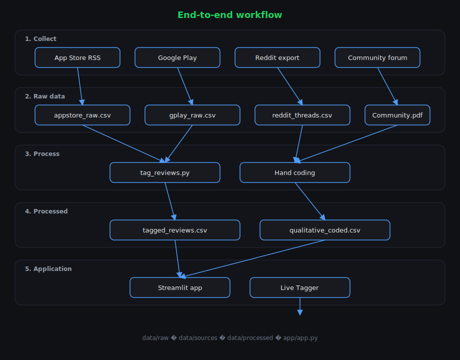
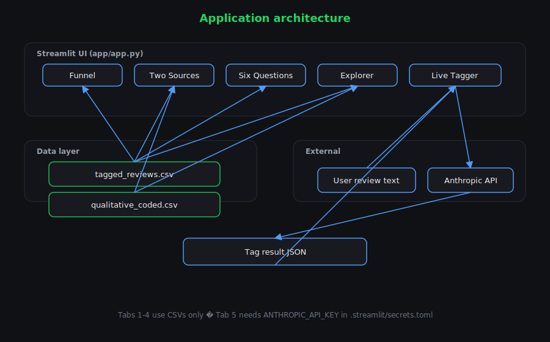

# Spotify Discovery — Workflow & Architecture

### View diagrams (no Markdown preview)

| File | How to open |
|------|-------------|
| **`docs/workflow.html`** | Double-click → opens in Chrome/Edge with both flowcharts |
| `docs/diagrams/pipeline.svg` | Pipeline diagram (image) |
| `docs/diagrams/architecture.svg` | Architecture diagram (image) |

## End-to-end workflow

**File locations:** raw CSVs in `data/raw/` and `data/sources/` · processed outputs in `data/processed/` · app at `app/app.py`.

---

## Pipeline stages

### Stage 1 — Data collection

| Source | Script | Output | Notes |
|--------|--------|--------|-------|
| Apple App Store | `scripts/scrapers/appstore_scrape.py` | `data/raw/appstore_*.csv` | Country-specific; ~500 reviews/storefront max |
| Google Play | `scripts/scrapers/gplay_scrape.py` | `data/raw/gplay_raw.csv` | High volume; English pool is global (not per-country) |
| Reddit | Manual export / PDF → parse | `data/sources/` | API self-registration often blocked in 2026 |
| Spotify Community | Manual export | `data/sources/Community_Data.pdf` | Forum threads on discovery / AI |

All raw review CSVs share one schema:

`source, country, review_id, author, rating, title, body, version, updated`

---

### Stage 2 — Quantitative tagging

**Script:** `scripts/tag_reviews.py`

**Input:** `data/raw/appstore_raw.csv` + `data/raw/gplay_raw.csv`

**Output:** `data/processed/tagged_reviews.csv`

**Logic:**

1. Merge and dedupe by `review_id`
2. Match keyword lists for six research questions (boolean columns)
3. Assign coarse **bucket**: A, B, both, or irrelevant
4. Attach `question_tags` (comma-separated hit list)

No API calls — deterministic and reproducible.

---

### Stage 3 — Qualitative coding

**Input:** Reddit PDF/CSV + Community forum export

**Output:** `data/processed/qualitative_coded.csv`

**Logic:** Manual / semi-manual coding at comment level:

- `bucket` — A, B, C, both, irrelevant
- `question_tags` — which brief questions the comment addresses
- `near_duplicate` — flag to drop inflated counts

Bucket **C** (AI music distrust) is primarily visible here, not in keyword tagging at scale.

---

### Stage 4 — Streamlit dashboard

**Entry point:** `streamlit run app/app.py` (from project root)

**Reads:**

- `data/processed/tagged_reviews.csv` — funnel, six questions, app-store explorer
- `data/processed/qualitative_coded.csv` — forum explorer, C sub-theme, source comparison

**Live Tagger (optional):**

- Calls Anthropic Claude (`claude-haiku-4-5`) via key in `.streamlit/secrets.toml`
- Returns JSON: bucket, intensity, segment_hint, signal, evidence

---

## Application architecture

Same diagram in [`docs/workflow.html`](docs/workflow.html) (section 2).

### UI components

| Component | Data source | Computation |
|-----------|-------------|-------------|
| Funnel metrics | `tagged_reviews` | Count by `bucket`; A/(A+B) share |
| Source comparison | Both CSVs | A vs B per source; C folded into A for forums |
| Six questions | `tagged_reviews` | Sum of boolean `q1`…`q6` columns |
| Explorer | Selected CSV | Filter `bucket` ∈ {A,B,C,both} |
| Live Tagger | User paste | Claude prompt → JSON classification |

### Caching

`@st.cache_data` on `load_quant()` and `load_qual()` — CSVs reload only when file content or loader code changes.

### Theming

`.streamlit/config.toml` — dark base, Spotify green primary (`#1DB954`).

---

## Research question mapping

| Question | Quant column(s) | Primary signal |
|----------|-------------------|----------------|
| Q1 — Why struggle to discover? | `q1_struggle_discover` | Narrow recs, can't find new |
| Q2 — Recommendation frustrations? | `q2_recommendation_frustration` | Algorithm, radio, DJ |
| Q3 — Listening behaviors? | `q3_listening_goals` | Control, mood, variety |
| Q4 — Repeat listening causes? | `q4_repeat_listening` | Shuffle, same songs |
| Q5 — Segment differences? | `q5_segment_signal` | Premium, churn (weak keyword signal) |
| Q6 — Unmet needs? | `q6_unmet_needs` | Feature requests, block AI |

---

## Deployment notes

**Local:** `streamlit run app/app.py`

**Streamlit Cloud:**

1. Push repo to GitHub (exclude `venv/`, `.env`, `.streamlit/secrets.toml` via `.gitignore`)
2. Deploy `app/app.py` as main file
3. Set `ANTHROPIC_API_KEY` in Streamlit Cloud Secrets
4. Large CSVs in `data/processed/` must be in the repo or loaded from external storage

---

## Key design decisions

1. **Two-source triangulation** — App stores for scale; forums for depth and bucket C
2. **A/B split over blended %** — Problem definition = repetition mechanics (B), confirmed across sources
3. **Keyword tagging for scale, hand coding for nuance** — Different tools for different jobs
4. **Paths relative to project root** — All scripts resolve `ROOT` via `pathlib` so they run from any working directory inside the project
